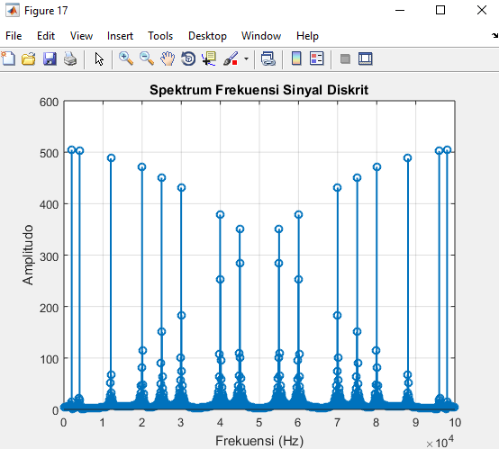
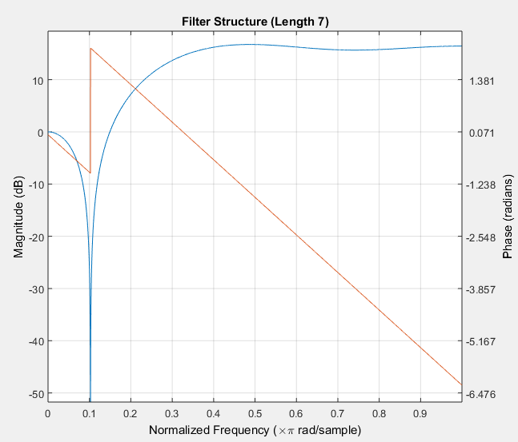
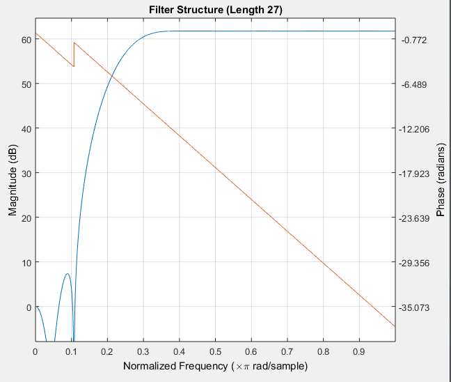

Nama : Surya Aditya Pratama

Nim : 5311421026

%MENAMPILKAN DATA

\% Memuat data

load(\'sinyal_diskrit1.mat\');

\% Menampilkan grafik sinyal diskrit

figure;

stem(n, xn, \'Marker\', \'o\', \'LineWidth\', 1.5);

title(\'Grafik Sinyal Diskrit Asli\');

xlabel(\'n\');

ylabel(\'xn\');

grid on;

\% Hitung Transformasi Fourier Diskrit (DFT) dari sinyal

N = length(xn);

X = fft(xn);

Fs = 100000;

\% Hitung nilai frekuensi untuk setiap bin dalam DFT

frequencies = (0:N-1) \* (Fs / N);

\% Menampilkan spektrum frekuensi

figure;

stem(frequencies, abs(X), \'Marker\', \'o\', \'LineWidth\', 1.5);

title(\'Spektrum Frekuensi Sinyal Diskrit\');

xlabel(\'Frekuensi (Hz)\');

ylabel(\'Amplitudo\');

grid on;

\% Identifikasi frekuensi dominan (misalnya, dengan menemukan puncak
dalam spektrum)

\[\~, idx\] = findpeaks(abs(X), \'MinPeakHeight\', max(abs(X))/10);

\% Tampilkan frekuensi dominan

dominantFrequencies = frequencies(idx);

disp(\'Frekuensi Dominan (Hz):\');

disp(dominantFrequencies);

\% Filter the discrete signal using the designed FIR filter

filteredSignal = filter(firFilter, xn);

\% Menampilkan grafik sinyal setelah difilter

figure;

subplot(2,1,1);

stem(n, xn, \'Marker\', \'o\', \'LineWidth\', 1.5, \'Color\', \'b\');

title(\'Grafik Sinyal Diskrit Asli\');

xlabel(\'n\');

ylabel(\'xn\');

grid on;

subplot(2,1,2);

stem(n, filteredSignal, \'Marker\', \'o\', \'LineWidth\', 1.5,
\'Color\', \'r\');

title(\'Grafik Sinyal Setelah Difilter\');

xlabel(\'n\');

ylabel(\'Filtered Signal\');

grid on;

\% Visualize the frequency response of the filter

fvtool(firFilter, \'Analysis\', \'freq\');

numDominantFrequencies = numel(dominantFrequencies);

disp(\[\'Number of Dominant Frequencies: \',
num2str(numDominantFrequencies)\]);

Frekuensi Dominan (Hz):

1.0e+04 \*

Columns 1 through 7

0.1998 0.3996 1.1988 1.9980 2.4975 2.9970 3.9960

Columns 8 through 14

4.4955 5.5045 6.0040 7.0030 7.5025 8.0020 8.8012

Columns 15 through 16

9.6004 9.8002

Number of Dominant Frequencies: 16

{width="3.6496062992125986in"
height="2.6374682852143483in"}{width="3.6496062992125986in"
height="3.305178258967629in"}{width="3.6496062992125986in"
height="3.287280183727034in"}{width="3.649757217847769in"
height="3.2631583552055994in"}

%MENAMPILKAN KOEFISIEN FILTER

\% Memuat data

load(\'sinyal_diskrit1.mat\');

\% Hitung Transformasi Fourier Diskrit (DFT) dari sinyal

N = length(xn);

X = fft(xn);

frequencies = (0:N-1) \* (Fs / N);

\% Desain filter FIR High-Pass dengan panjang filter yang berbeda (5,
11, 21, 31)

filterLengths = \[5, 11, 21, 31\];

for i = 1:length(filterLengths)

filterLength = filterLengths(i);

\% Hitung koefisien filter menggunakan metode Transformasi Fourier

filterCoefficients = zeros(1, filterLength);

for n = 1:filterLength

if n \~= (filterLength + 1) / 2

filterCoefficients(n) = -sin(2\*pi\*Fpass\*(n - (filterLength + 1) / 2)
/ Fs) / (pi\*(n - (filterLength + 1) / 2));

else

filterCoefficients(n) = 1 - 2 \* Fpass / Fs;

end

end

\% Normalisasi agar jumlah koefisien menjadi 1

filterCoefficients = filterCoefficients / sum(filterCoefficients);

\% Tampilkan koefisien filter

disp(\[\'Filter Coefficients (Length \', num2str(filterLength),
\'):\'\]);

disp(filterCoefficients);

\% Hitung persamaan perbedaan filter

filterOrder = filterLength - 1;

differenceEquation = sprintf(\'y\[n\] = %s\*x\[n\]\',
num2str(filterCoefficients(1)));

for k = 2:(filterOrder + 1)

differenceEquation = strcat(differenceEquation, sprintf(\' +
%s\*x\[n-%d\]\', num2str(filterCoefficients(k)), k - 1));

end

disp(\[\'Filter Difference Equation (Length \', num2str(filterLength),
\'):\'\]);

disp(differenceEquation);

\% Tampilkan fungsi alih filter

figure;

freqz(filterCoefficients, 1, N, Fs);

title(\[\'Frequency Response (Length \', num2str(filterLength),
\')\'\]);

end

{width="4.013888888888889in"
height="3.048611111111111in"}{width="3.6493055555555554in"
height="2.795138888888889in"}{width="3.6496062992125986in"
height="2.7584995625546807in"}{width="3.6496062992125986in"
height="2.7752898075240595in"}

%KETIKA PANJANG FILTER DIGANTI

\% Memuat data

load(\'sinyal_diskrit1.mat\');

\% Menampilkan grafik sinyal diskrit

figure;

stem(1:length(xn), xn, \'Marker\', \'o\', \'LineWidth\', 1.5);

title(\'Grafik Sinyal Diskrit Asli\');

xlabel(\'n\');

ylabel(\'xn\');

grid on;

\% Hitung Transformasi Fourier Diskrit (DFT) dari sinyal

N = length(xn);

X = fft(xn);

Fs = 100000;

frequencies = (0:N-1) \* (Fs / N);

\% Desain filter FIR High-Pass dengan panjang filter yang berbeda (5,
11, 21, 31)

filterLengths = \[7, 17, 27, 37\];

for i = 1:length(filterLengths)

filterLength = filterLengths(i);

\% Hitung koefisien filter menggunakan metode Transformasi Fourier

filterCoefficients = zeros(1, filterLength);

for n = 1:filterLength

if n \~= (filterLength + 1) / 2

filterCoefficients(n) = -sin(2\*pi\*Fpass\*(n - (filterLength + 1) / 2)
/ Fs) / (pi\*(n - (filterLength + 1) / 2));

else

filterCoefficients(n) = 1 - 2 \* Fpass / Fs;

end

end

\% Normalisasi agar jumlah koefisien menjadi 1

filterCoefficients = filterCoefficients / sum(filterCoefficients);

\% Terapkan filter ke sinyal

filteredSignal = filter(filterCoefficients, 1, xn);

\% Tampilkan koefisien filter

disp(\[\'Filter Coefficients (Length \', num2str(filterLength),
\'):\'\]);

disp(filterCoefficients);

\% Tampilkan fungsi alih filter

filterFunction = poly2str(filterCoefficients, \'z\');

disp(\[\'Filter Transfer Function (Length \', num2str(filterLength),
\'):\'\]);

disp(filterFunction);

\% Hitung persamaan perbedaan filter

filterOrder = filterLength - 1;

differenceEquation = sprintf(\'y\[n\] = %s\*x\[n\]\',
num2str(filterCoefficients(1)));

for k = 2:(filterOrder + 1)

differenceEquation = strcat(differenceEquation, sprintf(\' +
%s\*x\[n-%d\]\', num2str(filterCoefficients(k)), k - 1));

end

disp(\[\'Filter Difference Equation (Length \', num2str(filterLength),
\'):\'\]);

disp(differenceEquation);

\% Gambar struktur filter

figure;

fvtool(filterCoefficients, 1, \'Analysis\', \'freq\');

title(\[\'Filter Structure (Length \', num2str(filterLength), \')\'\]);

end

{width="3.543307086614173in"
height="2.287250656167979in"}{width="3.543307086614173in"
height="2.9444280402449694in"}{width="3.543307086614173in"
height="3.067081146106737in"}{width="3.5430555555555556in"
height="3.0277777777777777in"}

\$MENGGUNAKAN TEKNIK WINDOW

\% Memuat data

load(\'sinyal_diskrit1.mat\');

\% Menampilkan grafik sinyal diskrit

figure;

stem(1:length(xn), xn, \'Marker\', \'o\', \'LineWidth\', 1.5);

title(\'Grafik Sinyal Diskrit Asli\');

xlabel(\'n\');

ylabel(\'xn\');

grid on;

\% Hitung Transformasi Fourier Diskrit (DFT) dari sinyal

N = length(xn);

X = fft(xn);

frequencies = (0:N-1) \* (Fs / N);

\% Desain filter FIR High-Pass dengan panjang filter yang berbeda (7,
17, 27, 37)

filterLengths = \[7, 17, 27, 37\];

for i = 1:length(filterLengths)

filterLength = filterLengths(i);

\% Hitung koefisien window (gunakan misalnya Hamming window)

window = hamming(filterLength)\';

\% Hitung koefisien filter menggunakan metode Transformasi Fourier dan
windowing

filterCoefficients = zeros(1, filterLength);

for n = 1:filterLength

if n \~= (filterLength + 1) / 2

filterCoefficients(n) = -sin(2\*pi\*Fpass\*(n - (filterLength + 1) / 2)
/ Fs) / (pi\*(n - (filterLength + 1) / 2));

else

filterCoefficients(n) = 1 - 2 \* Fpass / Fs;

end

end

\% Terapkan windowing

filterCoefficients = filterCoefficients .\* window;

\% Normalisasi agar jumlah koefisien menjadi 1

filterCoefficients = filterCoefficients / sum(filterCoefficients);

\% Terapkan filter ke sinyal

filteredSignal = filter(filterCoefficients, 1, xn);

\% Tampilkan koefisien filter

disp(\[\'Filter Coefficients (Length \', num2str(filterLength),
\'):\'\]);

disp(filterCoefficients);

\% Tampilkan fungsi alih filter

filterFunction = poly2str(filterCoefficients, \'z\');

disp(\[\'Filter Transfer Function (Length \', num2str(filterLength),
\'):\'\]);

disp(filterFunction);

\% Hitung persamaan perbedaan filter

filterOrder = filterLength - 1;

differenceEquation = sprintf(\'y\[n\] = %s\*x\[n\]\',
num2str(filterCoefficients(1)));

for k = 2:(filterOrder + 1)

differenceEquation = strcat(differenceEquation, sprintf(\' +
%s\*x\[n-%d\]\', num2str(filterCoefficients(k)), k - 1));

end

disp(\[\'Filter Difference Equation (Length \', num2str(filterLength),
\'):\'\]);

disp(differenceEquation);

\% Gambar struktur filter

figure;

fvtool(filterCoefficients, 1, \'Analysis\', \'freq\');

title(\[\'Filter Structure (Length \', num2str(filterLength), \')\'\]);

end

{width="3.1493055555555554in"
height="2.772222222222222in"}{width="3.1493055555555554in"
height="2.6680555555555556in"}{width="3.1496062992125986in"
height="2.663705161854768in"}{width="3.1493055555555554in"
height="2.6375in"}
